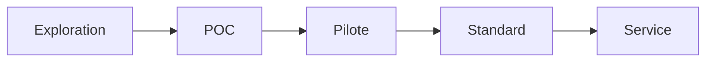

# Innovation Status

## Statut actuel du projet
- [ ] Exploration
- [x] POC
- [ ] Pilote
- [ ] Standard interne
- [ ] Service production

## Métadonnées
- **Date de création**: 2026-03-18
- **Responsable**: Équipe IA Platform (à confirmer)
- **Prochaine étape attendue**: Pilote sur un flux métier réel (CRM notifications)

## Critères de passage au niveau supérieur (POC -> Pilote)
1. Démontrer 2 intégrations applicatives réelles.
2. Mesurer latence p95 et taux d'erreur sur 2 semaines.
3. Mettre en place observabilité minimale (logs structurés + alertes).
4. Valider conformité sécurité (gestion token + exposition réseau).

## Risques identifiés
- Performance variable selon l'infrastructure CPU/GPU.
- Dépendance externe au hub de modèles/voix.
- Qualité perçue différente selon langue/voix.

## Trajectoire d'évolution

