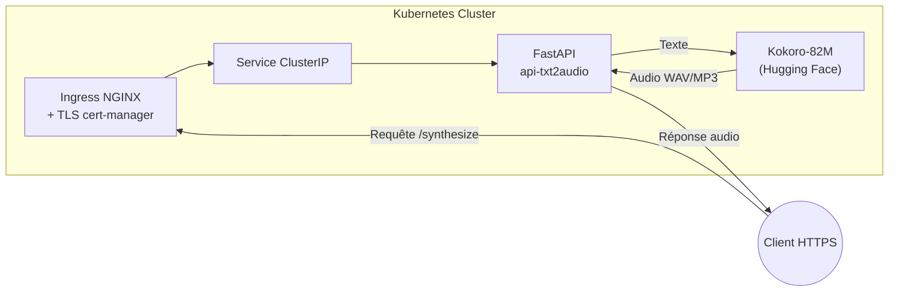

# API Text-to-Speech

## Description

API FastAPI pour la synthèse vocale, utilisant le modèle Kokoro-82M de Hugging Face.

## Construction de l'image Docker

```bash
docker build -t your-dockerhub-username/api-txt2audio .
```

## Déploiement avec Helm

```bash
helm install api-txt2audio ./helm/api-txt2audio
```

Assurez-vous que `cert-manager` est installé et configuré pour gérer les certificats TLS via Let's Encrypt.

## Accès à l'API

L'API sera accessible via HTTPS à l'adresse `https://api.example.com`.

---

## 🔧 Configuration TLS avec Let's Encrypt

Pour activer TLS avec Let's Encrypt, assurez-vous que `cert-manager` est installé dans votre cluster Kubernetes. Vous pouvez l'installer en suivant la documentation officielle :

```bash
kubectl apply -f https://github.com/cert-manager/cert-manager/releases/latest/download/cert-manager.yaml
```


Créez ensuite un `ClusterIssuer` pour Let's Encrypt :

```yaml
apiVersion: cert-manager.io/v1
kind: ClusterIssuer
metadata:
  name: letsencrypt-prod
spec:
  acme:
    server: https://acme-v02.api.letsencrypt.org/directory
    email: your-email@example.com
    privateKeySecretRef:
      name: letsencrypt-prod
    solvers:
      - http01:
          ingress:
            class: nginx
```

Appliquez ce fichier avec :

```bash
kubectl apply -f cluster-issuer.yaml
```


Assurez-vous que votre domaine (`api.example.com`) pointe vers l'adresse IP de votre Ingress Controller.

---

## 🚀 Déploiement

1. Construisez et poussez votre image Docker vers Docker Hub : ([Container image push then Ingress & Load Balancing in Kubernetes ...](https://medium.com/%40ahosanhabib.974/container-image-push-then-ingress-load-balancing-in-kubernetes-with-fastapi-in-private-data-3dd8305f6795?utm_source=chatgpt.com))

   ```bash
   docker build -t your-dockerhub-username/api-txt2audio .
   docker push your-dockerhub-username/api-txt2audio
   ```

2. Déployez l'application avec Helm :

   ```bash
   helm install api-txt2audio ./helm/api-txt2audio
   ```

3. Vérifiez que le certificat TLS est émis et que l'Ingress est configuré correctement :

   ```bash
   kubectl get ingress
   kubectl describe certificate
   ```

---

## 🧭 Diagramme d'architecture


