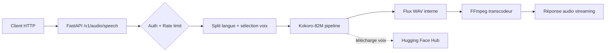

# Architecture

## Composants
- **Client**: envoie une requête TTS HTTP.
- **FastAPI app (`app.py`)**: auth, rate-limit, orchestration pipeline.
- **Kokoro pipeline**: synthèse vocale et chargement des voix HF.
- **FFmpeg**: transcodage streaming en format cible.
- **Stock externe HF Hub**: récupération des voix.

## Diagramme

## Flux d'exécution (résumé)
1. Vérification du token Bearer.
2. Validation JSON (Pydantic).
3. Découpage multilingue + détection langue.
4. Chargement/caching pipeline + voix.
5. Génération audio + streaming de la réponse.
